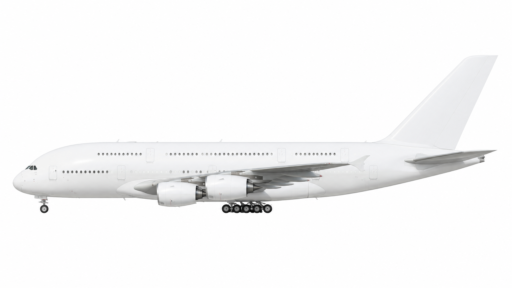
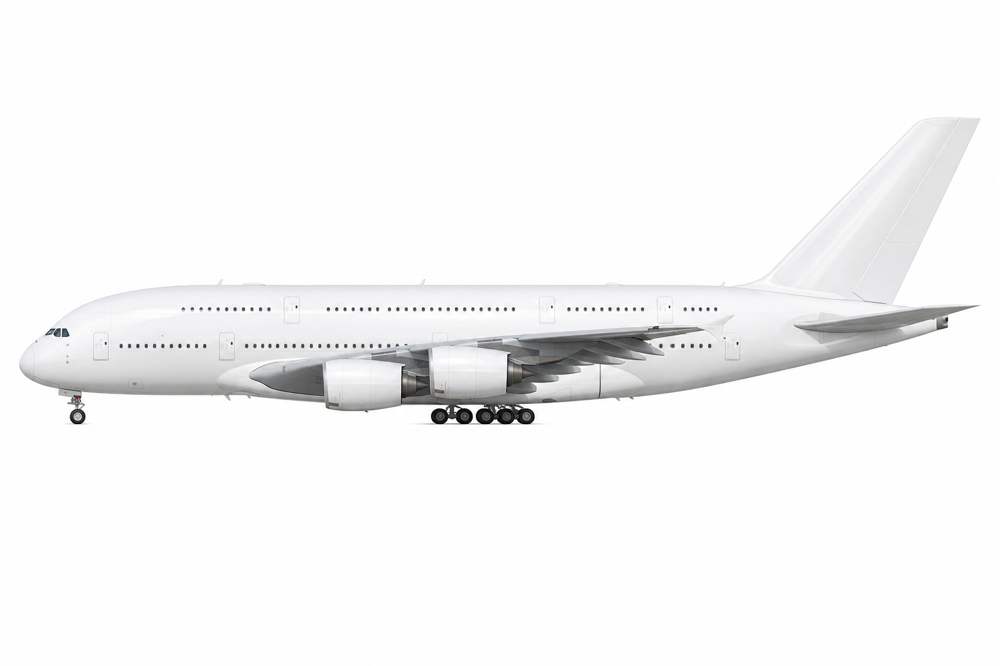
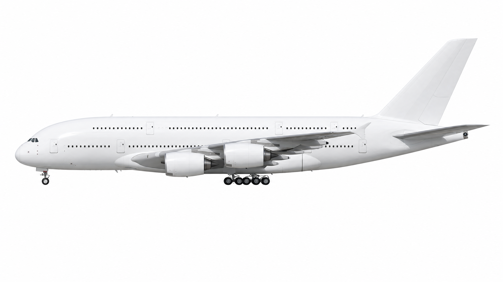
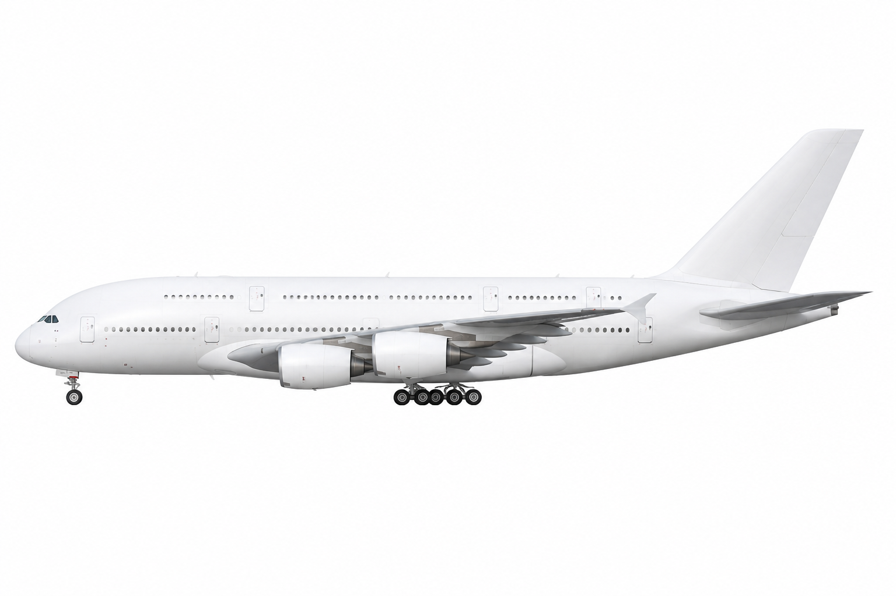
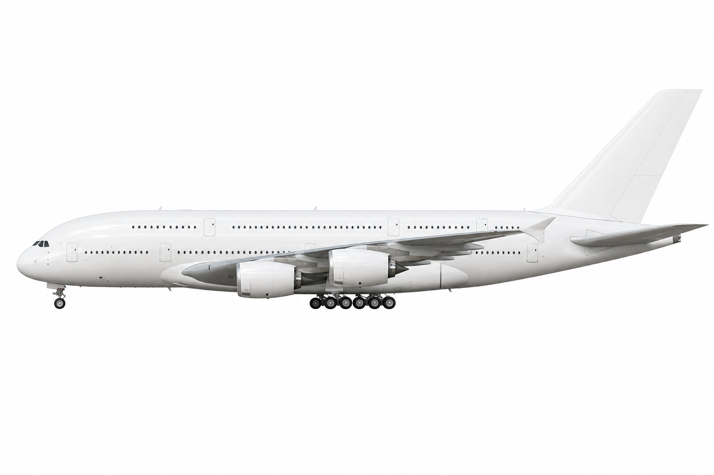

# Aircraft Illustration Generator

Generates clean, catalog-style side-view aircraft illustrations from a list of
airframes using the OpenAI image API. Each aircraft from `input/aircrafts.csv`
is rendered with the prompt template in `input/prompt.txt` and saved as a PNG
plus a matching JSON metadata file.

## Layout

- `input/aircrafts.csv` — the airframe list. Two columns: `value` (the ICAO-style
  code used for the output filename) and `title` (the full model name injected
  into the prompt).
- `input/prompt.txt` — the prompt template. The aircraft title is substituted
  in wherever `<name>` (or `<aircraft model>`, `[aircraft model]`,
  `{{aircraft_model}}`) appears.
- `src/generate-aircraft-images.js` — the generator script.
- `src/remove-background.js` — turns the rendered images into transparent PNGs.
- `src/postprocess-images.js` — resizes the transparent PNGs into the icon and preview variants.
- `output/ai_gen/` — generated (opaque, white-background) images and metadata.
- `output/transparent/` — background-removed, transparent versions.
- `output/postprocess/<icao>/` — resized icon/preview variants in AVIF, WebP and PNG, one subdirectory per aircraft.
- `output_comparison/` — sample renders at different quality settings (see below).

## Prerequisites

- Node 24 (run directly, no build step).
- An OpenAI API key with image-generation access.

Add the key to this directory's `.env` (copy `.env.dist` to start):

```bash
cp .env.dist .env   # then fill in OPENAI_API_KEY
```

## Running

The script resolves all paths relative to itself, so it can be run from
anywhere — `input/prompt.txt`, `input/aircrafts.csv`, and `.env` are always
read from this directory:

```bash
cd aircraft-illustration-generator
node src/generate-aircraft-images.js
```

Images and `<value>.json` metadata are written to `output/ai_gen/`, along with a
`manifest.json` summarizing the run.

### Dry run

Validate the CSV and preview the resolved prompts without calling the API (and
without an API key):

```bash
DRY_RUN=1 node src/generate-aircraft-images.js
```

This writes only the `<value>.json` metadata files containing the final prompt.

### Configuration

All settings are environment variables (defaults in parentheses):

| Variable | Default | Description |
| --- | --- | --- |
| `OPENAI_API_KEY` | — | Required unless `DRY_RUN=1`. |
| `OPENAI_IMAGE_MODEL` | `gpt-image-2` | Image model. |
| `OPENAI_IMAGE_SIZE` | `2560x1440` | Output resolution. |
| `OPENAI_IMAGE_QUALITY` | `medium` | `low` / `medium` / `high`. |
| `OPENAI_IMAGE_BACKGROUND` | `opaque` | `opaque` or `transparent`. |
| `OPENAI_IMAGE_FORMAT` | `png` | Output format / file extension. |
| `CONCURRENCY` | `1` | Number of parallel workers. |
| `START_AT` | `0` | Skip the first N rows. |
| `LIMIT` | `0` | Process at most N rows (0 = all). |
| `DRY_RUN` | — | Set to `1` to skip API calls. |

Example — render the first 5 aircraft at high quality with 3 workers:

```bash
OPENAI_IMAGE_QUALITY=high CONCURRENCY=3 LIMIT=5 \
  node src/generate-aircraft-images.js
```

## Removing backgrounds

The rendered images sit on a pure white background. `remove-background.js`
converts them to transparent PNGs. It's a zero-dependency script (Node's built-in
`zlib` only): it decodes each PNG, flood-fills the white background inward from
the image edges — so white paint *inside* the aircraft is preserved — feathers
the silhouette edge, and re-encodes as RGBA.

```bash
cd aircraft-illustration-generator
node src/remove-background.js                 # process every PNG in output/ai_gen/
node src/remove-background.js a320.png b738.png   # only specific files
```

Inputs are read from `output/ai_gen/`; transparent results are written to
`output/transparent/` with the same filenames.

### Configuration

| Variable | Default | Description |
| --- | --- | --- |
| `BG_THRESHOLD` | `248` | Min per-channel brightness (0–255) for a pixel to count as background. Lower removes more; too low lets the fill leak into the (near-white) airframe. |
| `BG_EDGE_DELTA` | `4` | Max luminance step to a neighbour for the fill to pass through a bright pixel. Stops the fill at faint white-on-white edges (tail tips, fuselage tops) so it can't eat into the airframe. |
| `BG_FEATHER_BAND` | `40` | Width of the soft alpha edge below the threshold, in brightness levels. Set `0` for a hard edge. |

```bash
BG_THRESHOLD=245 BG_EDGE_DELTA=3 node src/remove-background.js
```

## Postprocessing (icon & preview variants)

`postprocess-images.js` resizes each transparent PNG into the sizes the app
serves, in three formats. It uses [`sharp`](https://sharp.pixelplumbing.com),
so install dependencies first:

```bash
cd aircraft-illustration-generator
npm install
npm run postprocess                              # process every PNG in output/transparent/
node src/postprocess-images.js a320.png b738.png   # only specific files
```

For each input it writes 15 files to `output/postprocess/<icao>/` — five sizes,
each as AVIF, WebP and PNG, named `<base>-<size>.<ext>`:

| Size | Use |
| --- | --- |
| `icon-64x36`, `icon-128x72` | small table/list icons (1× and 2×) |
| `600x338`, `1200x675` | standard preview (1× and 2×) |
| `1800x1013` | extra-large preview (3×) |

Images are resized with `fit: contain` onto a transparent canvas, so the 16:9
silhouette is never cropped or stretched.

### Configuration

| Variable | Default | Description |
| --- | --- | --- |
| `AVIF_QUALITY` | `50` | AVIF quality (0–100). |
| `WEBP_QUALITY` | `82` | WebP quality (0–100). |
| `AVIF_EFFORT` | `4` | AVIF encoder effort (0–9). Higher is smaller but slower. |

## Quality comparison

Sample renders of the Airbus A380-800 (`A388`) across quality settings, from
`output_comparison/`:

| Low | Medium | High |
| --- | --- | --- |
|  |  |  |

The `gpt-2-low` and `gpt-2-high` folders also include a downscaled `-lores`
variant alongside each `-hires` render:

| Low (lores) | High (lores) |
| --- | --- |
|  |  |
